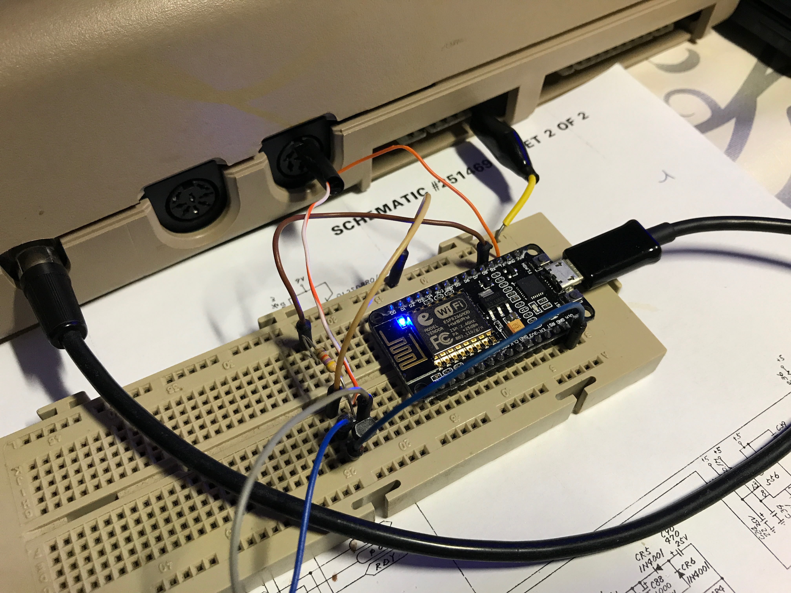

# ESP8266-based C64 datasette emulator

Yes. An ESP8266-based datasette emulator. For the Commodore 64. In 2017.



## Work in progress!!

This is a proof of concept. Planned features are:

* Upload TAP files via an embedded web server and be able to store them in the SPI flash
* Same with PRG files, useful to cross-develop on a PC then transfer the PRG over to real hardware for testing.
* OTA upgradable
* PCB + 3D enclosure CAD files so that you can build your own.

## Compiling

Install platformio.

Edit `~/.platformio/packages/framework-esp8266-rtos-sdk/ld/eagle.app.v6.ld` so that the MEMORY block looks like this: 

```
MEMORY
{
  dport0_0_seg :                        org = 0x3FF00000, len = 0x10
  dram0_0_seg :                         org = 0x3FFE8000, len = 0x14000
  iram1_0_seg :                         org = 0x40100000, len = 0x8000
  irom0_0_seg :                         org = 0x40220000, len = 0x3db000
}
```

Compile:

```
pio run
```

To flash:

```
pio run -t upload
```

## Wiring

Again, work in progress.

R = 47K. Transistor = any NPN. Datasette pin 6 is /SENSE (low if key pressed on datasette), let's force it low for now. Will be eventually driven by the ESP8266.

Power the NodeMCU either from a PC's USB port (easiest), or from the datasette port (pin B-2 <-> Vin).


## Testing

1. Turn on the C64 first
2. LOAD + RETURN
3. Turn on the NodeMCU
4. Roland Hermans' PSID64 with one of DRAX's finest tunes, _Caught in the Middle_, will play. Take delight :)


Do NOT turn the ESP8266 contraption on before the C64. I don't think the 6510 likes any of its pins driven with its power off.

